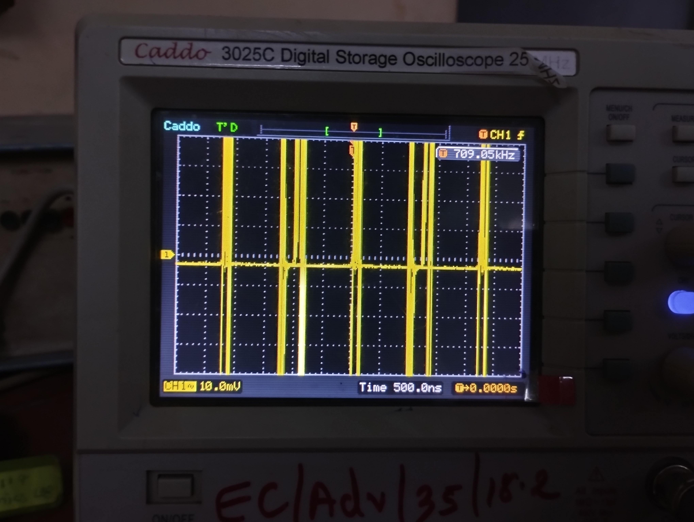
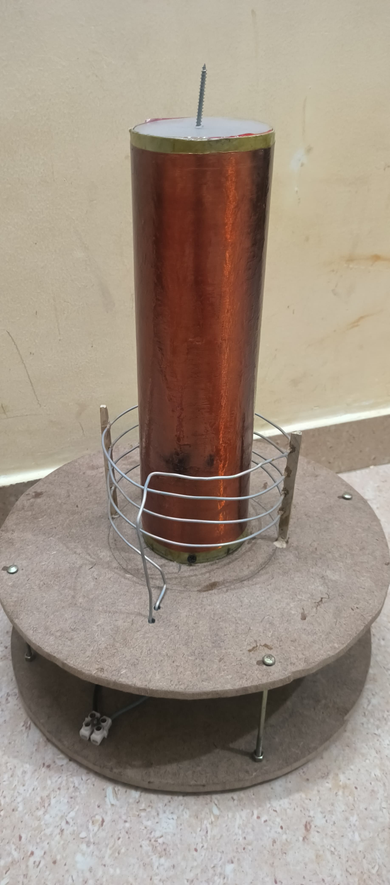

# Applied-Electronics-Archive

**Engineer:** mikey-7x (Yogesh)  
**Focus:** Analog Circuitry, Power Electronics, RF Systems, and Embedded Hardware Integration

Welcome to my hardware engineering archive. This repository documents my complete, self-taught evolution in electronics engineering. It contains the digitized versions of my 10 personal engineering notebooks, representing hundreds of electronic circuits I have designed, hand-drawn, built, and tested over the years. 

My engineering approach is heavily grounded in hands-on experimentation, component-level integration, and rapid prototyping. Through extensive physical testing and salvaging components to build entirely new systems, I have developed the ability to instantly identify SMD/through-hole values and approximate complex RF and analog values by practical intuition and memory.

---

## 🚀 Featured Hardware & RF Projects

### [1] Inverter Using Just Two Components 💥
*A minimalist approach to power electronics.*
*   **Input:** 12V-20V DC, 5A
*   **Output:** 220V AC (Capable of driving a 100W load)
*   **Components:** 1x 2N6107 / 2N6109 Power Transistor, 1x Ferrite Core Transformer. (Zero resistors, capacitors, or ICs).
*   **Resources:** 
    *   
    *   

### [2] Tesla Experiments: High Voltage Wireless Power Transmission 💥
Welcome to my Tesla Coil experimental series! In this ongoing project, I am exploring the principles of Nikola Tesla's high-frequency, high-voltage resonant transformers with the ultimate goal of demonstrating and scaling wireless power transmission.

**⚡ About This Series:**
Throughout these experiments, my team designed, wound, and tested custom solid-state driver circuits and resonant coils. By generating extremely high voltages at high frequencies, these circuits create strong electromagnetic fields capable of transferring electrical energy through the air without physical wires. Watch as we tweak the primary/secondary ratios, test different MOSFET/transistor driver setups, and push the limits of the arcs!

**Team Members:** Yogesh (mikey-7x), Maharshi, and Kishan.

*   **Tesla Experiment #1:** High Voltage Wireless Power Transmission
    

*   **Tesla Experiment #2:** High Voltage Wireless Power Transmission
    

*   **Tesla Experiment #3:** Final project at my BBIT College in Gujarat
    
    
    

*   **Tesla Experiment #4:** Tesla Testing at Rhino Machines during my internship
    

> ⚠️ **SAFETY WARNING:** These experiments involve deadly mains voltage and extremely high-voltage, high-frequency output. Do not attempt to recreate these circuits without proper electrical safety training, isolation, and precautions. 

### [3] Mini Singing Tesla Coil: Playing Music with High-Voltage Sparks! 💥
In this video, I demonstrate my custom-built Mini Singing Tesla Coil—a high-voltage circuit that plays music directly through electrical arcs without using a traditional speaker! 

* 
* 

**⚙️ The Engineering Behind the Music:**
The core of this project is a self-resonating Tesla coil circuit. To make the coil "sing," I implemented Amplitude Modulation (AM). By integrating a TIP122 Darlington transistor, I am able to modulate the bias provided to the resonating circuit using an incoming audio signal. As the audio signal fluctuates, the TIP122 rapidly alters the power of the high-frequency electrical arcs. These expanding and contracting arcs instantly heat and cool the surrounding air, creating pressure waves that our ears perceive as perfectly clear music. The spark itself becomes the speaker cone!

### [4] Mini Tesla Coil Experiment: Creating Violet Plasma Arcs Inside a Glass Bulb! 💥
In this demonstration, I showcase a fascinating high-voltage physics phenomenon using my custom-built mini Tesla coil. By bringing a standard glass bulb into the high-frequency RF field of the coil, the low-pressure gas inside the bulb becomes ionized. This creates striking, violet-colored plasma arcs, effectively turning a simple bulb into a miniature plasma globe!

* 
* 
* 

**⚙️ The Science Behind the Arcs:**
The Tesla coil acts as a resonant transformer, generating an intense, high-voltage, high-frequency electromagnetic field. When the glass bulb enters this field, the electrical energy passes right through the glass (acting as a dielectric) and excites the gas molecules inside. As the gas ionizes and enters a plasma state, it forms those visible violet filaments, all without any direct wired connection to the bulb!

### [5] Single-Wire Power Communication Prototype 💥
In this experiment, I demonstrate a unique prototype for Single-Wire Power Communication, inspired by Nikola Tesla's high-frequency transmission concepts.

**⚡ The Setup & The Discovery:**
The main power source is a separate, custom-built mini high-frequency Tesla coil running on a self-oscillating frequency (powered by a 3.7V 18650 battery). Typically, if you take a single wire from a Tesla coil to an LED, you have to touch the other leg of the LED with your bare skin so your body acts as a ground to turn it on. However, in this video, I demonstrate a workaround I discovered! Instead of using human skin contact, I connected the second leg of the LED to a completely unpowered 74HC04 (Hex Inverter) ring oscillator circuit.

**⚙️ How it Works:**
Even though the 74HC04 ring oscillator has no battery or power supply connected to it, the physical PCB, components, and the IC itself act as a capacitive load. Because the Tesla coil outputs high-frequency AC, the unpowered circuit board provides enough stray capacitance to complete the circuit with the surrounding environment, lighting up the LED brightly with only ONE wire connected to the power source and absolutely zero human contact!

**🛠️ Hardware Used:**
*   Self-oscillating mini high-frequency Tesla Coil (Transmitter)
*   74HC04 Hex Inverter IC configured as a Ring Oscillator (Unpowered / acting as a capacitive ground)
*   Single LED & single wire transmission line

### [6] Self-Powered 7MHz Frequency Counter Prototype 💥
In this video, I demonstrate a custom-built ATmega328p microcontroller-based frequency counter capable of precisely measuring frequencies up to 6.5 - 7 MHz. 

**⚡ The Engineering Hack: It Runs Without a Power Supply!**
If you watch closely, you will see that the 12V battery bank is completely physically disconnected from the board. Instead of relying on an external battery, this frequency counter is designed to draw its operating power directly from the device and the signal it is actively measuring! By extracting parasitic power from the input signal, it boots up the microcontroller and drives the LCD display entirely on its own.

**⚠️ Circuit Limitations:**
Because the circuit relies on the input signal for power, it requires a signal source with enough current to drive the ATmega328p and the LCD. When measuring very high-frequency signals where the available power/current is extremely low, the signal may not be sufficient to turn on the counter. 

**🛠️ Hardware Specs:**
*   **Brain:** ATmega328p Microcontroller
*   **Display:** 16x2 LCD
*   **Measurement Range:** Up to 6.5 - 7 MHz
*   **Power Source:** Parasitic (Draws power directly from the measured signal)

---

## 🏭 Industrial Automation & Control Systems (Rhino Machines Internship)

During my internship at Rhino Machines Pvt. Ltd., I expanded my expertise from discrete electronics into heavy industrial electrical control. I was tasked with designing highly optimized, cost-effective automation systems using pure electrical relay logic, strictly avoiding microcontrollers or electronic PCBs.

> **🏅 Special Acknowledgement:** I would like to extend a special thanks to my friend and colleague, **Kishan Chauhan**, who provided me with invaluable knowledge and mentorship regarding the practical functionality and integration of industrial electrical components during my time at Rhino Machines. 

### 🏗️ Project 1: Automatic Crane Lifting Mechanism
**Objective:** Design a fully automated crane cycle using the absolute minimum number of electrical components.

*   **Operation:** A single push of switch 'S' activates contactor 1, running the motor in the forward direction to lift the crane upwards.
*   Once the crane reaches the top, limit switch 1 is pushed, stopping the motor for a specific duration controlled by a timer's delay.
*   After the delay, the system automatically reverses to bring the crane down and stops completely.
*   **Safety Constraints:** The line wire is jointed in series with an MCB, an overload relay, and an emergency switch to ensure human safety and short-circuit protection. If the load increases, the overload relay automatically switches off the system, or it can be manually shut down via the emergency switch.

*(Click image to watch the live hardware demonstration)*

### ⚙️ Project 2: The Breakthrough - Fully Automatic Crusher Machine
**The Mentor's Challenge:** For our final task, we were asked to design an automatic garbage crusher machine operated by a single ON/OFF switch. The workflow required a pre-set delay before starting, an automatic reverse function for a fixed period if the crusher jammed/overloaded, and an automatic return to forward crushing. The major constraint: use a maximum of three timers.

Rhino Machines had already developed a highly advanced version of this machine using three timers and multiple contactors. It was considered an almost impossible task for a student to optimize further.

**My Solution (The Time Interchange Method):**
I spent two straight days intensely focused on the circuit design, determined to break the limits of the original industrial standard. I successfully achieved the impossible: **I developed the exact same complex workflow using just one timer and two contactors.**

*   **How it Works:** Phase current turns on contactor 3 through the NO terminal of the overload relay, immediately starting the single timer's delay.
*   After the delay, Contactor-1 starts, running the 3-phase motor in the forward (crushing) direction.
*   If the system jams, overload relay-1 detects the load, opening its NC terminal to turn off contactor-1 and stop the motor.
*   Instead of relying on multiple timers to manage the reverse and resume functions like the original design, I configured this single timer to interchange and control all three distinct time cycles.

When I presented the live demonstration, my mentor was highly impressed and immediately called the Head of Rhino Machines to watch. They were thoroughly amazed by the optimization, which led them to review my Tesla coil experiments with equal enthusiasm. This milestone proved my ability to heavily optimize complex, real-world industrial machinery.

*(Detailed schematics and presentation slides for these automation systems are available in the `Rhino ppt final.pdf` file included in this repository).*

---

## 📚 The 10 Books: An Engineering Journey

These 10 notebooks represent my raw progression from learning basic symbols to designing highly complex telecommunications hardware, power electronics, and bio-electronic integrations.

### The Foundation (Books 1 & 2) 
The early notebooks show my initial steps into hardware, documenting my very first successful experiments.
*   **Audio & Automation:** Early audio work utilizing TDA2030 and MJE3055 amplifiers, NE555 timer projects, metal detectors, and automatic street light circuits utilizing LDRs and BT136 components.
*   **Wireless Sound:** Experimental circuits for transferring sound wirelessly via light/laser sources.
*   **EMP Generators:** Early designs for electromagnetic pulse (EMP) generation and basic signal jammers.

### Power Electronics & High Voltage (Books 3, 4 & 5) 
These notebooks focus on pushing the boundaries of power handling, DC-to-AC conversion, and extreme voltage systems.
*   **Massive Power Inverters:** Evolution from basic oscillators to massive 1500W, 2000W, and 5000W pure sine wave and modified sine wave inverters utilizing SG3525 and CD4047 controllers with heavy MOSFET arrays (IRF3205/IRFZ44N) and custom-wound ferrite transformers.
*   **High Voltage & Plasma:** Designs for high-frequency solid-state Tesla coils, plasma ball drivers, and discrete pulse stun guns capable of extreme voltage multiplication.
*   **Class-D Amplification:** High-efficiency, low-heat 250W Class-D audio amplifier architectures.
*   **High-Voltage Generation:** Built robust, discrete driver circuits for Tesla coils and scaled 12V-to-220V power inverters focusing on raw, high-current switching efficiency using components like the TTC5200 and 2N2222A.
*   **Inductive Power Transfer:** Prototyped functional wireless charging systems and metal detection arrays using minimal component counts and raw analog logic.

### Advanced RF, Telecommunications & Jamming (Books 6, 7, 8 & 9) 
The circuit complexity and schematic drafting quality jump dramatically here, featuring advanced RF engineering and spectrum manipulation.
*   **Tactical Signal Jammers:** Comprehensive broadband jamming devices targeting highly specific modern communication bands, including GSM, CDMA, 3G, and 4G LTE frequencies (900MHz to 2600MHz).
*   **Long-Range Broadcast:** Custom 2km TV transmitters, 3W to 15W FM Radio Power Amplifiers (88-108 MHz), and shortwave transmitters.
*   **Complex Transceivers:** Multi-band Superheterodyne and Regenerative receivers, complete Walkie-Talkie architectures, and CW (Continuous Wave) transceivers built completely from discrete components.
*   **Microwave-Band VCOs:** Designed and built 7.45 GHz Colpitts and differential cross-coupled Voltage Controlled Oscillators (VCOs) from scratch, utilizing Infineon BFP420 transistors for telecommunications hardware.
*   **Wideband Low Noise Amplifiers (LNAs):** Engineered discrete LNAs targeted at 900MHz and 1800MHz (GSM/LTE bands). These designs prioritize signal gain and noise figure reduction using practical impedance matching and component-level tuning rather than relying purely on theoretical mathematical modeling.
*   **Discrete Receiver Architectures:** Developed highly sensitive regenerative and superheterodyne receivers for shortwave and VHF bands. The designs utilize specific low-noise BJTs (like the C9018) and custom-wound inductive coils to isolate and decode signals.

### Bio-Electronics, Embedded Systems & Measurement (Book 10) 
My most recent work bridging analog hardware with digital processing and human biology.
*   **Brain-Computer Interfaces (BCI):** Custom-designed EEG (Electroencephalogram) sensors using precision NE5534AP/TL081 instrumentation amplifiers. Includes an ambitious "mind control mouse" concept designed to capture brainwave stimuli via active electrodes.
*   **Airband & Specialized Receiving:** Highly sensitive Airband receivers designed to intercept aviation communications (108-137 MHz).
*   **Digital Microcontrollers:** Bare-metal ATmega328 programming, Arduino Uno bootloading, NRF24L01 wireless data transceiver integration, and custom digital frequency counters utilizing LCD interfaces.

---

## 🛠️ Skills Demonstrated

*   **Tuned RF Impedance Matching & Calculus:** Practical application of filters, RF oscillators, and Butterworth filter calculations for precise antenna tuning and optimal power transfer.
*   **Custom Magnetic Component Fabrication:** Calculating and designing air-core inductors and air-core IF coils using specific AWG copper wire formulas.
*   **Discrete Component Architecture:** The ability to construct complex logic gates, specialized oscillators (Colpitts, Hartley, Wien Bridge), and high-power amplifier stages without relying on pre-packaged ICs.
*   **PCB & Circuit Fabrication:** Excellent soldering skills with a deep understanding of discrete components.
*   **Component Identification:** Instant visual recognition of resistor, capacitor, inductor, and SMD color codes/values.
*   **High-Power Systems:** Safe handling and design of high-voltage Tesla coils, power amplifiers (Class A through H), and complex radio frequency systems.
*   **Reverse Engineering:** Pinout tracing and reverse engineering of modern consumer interfaces.

---

## ⚖️ License & Copyright

**© mikey-7x. All Rights Reserved.**
The circuit diagrams, documentation, and concepts provided in this repository are open for educational review and personal study. 

**Strict Non-Commercial Use:** You may not use, manufacture, or distribute these designs for any commercial purpose or financial profit. 

**Attribution:** If any of these circuits are modified, adapted, or shared in an educational context, clear and explicit attribution to the original creator (mikey-7x) must be provided.
