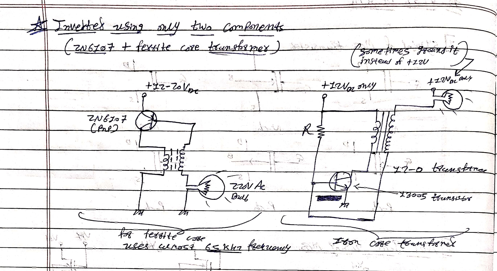

# Applied-Electronics-Archive

**Engineer:** mikey-7x  
**Focus:** Analog Circuitry, Power Electronics, RF Systems, and Embedded Hardware Integration

Welcome to my hardware engineering archive. This repository documents my complete, self-taught evolution in electronics engineering. It contains the digitized versions of my 10 personal engineering notebooks, representing hundreds of electronic circuits I have designed, hand-drawn, built, and tested over the years. 

My engineering approach is heavily grounded in hands-on experimentation, component-level integration, and rapid prototyping. Through extensive physical testing and salvaging components to build entirely new systems, I have developed the ability to instantly identify SMD/through-hole values and approximate complex RF and analog values by practical intuition and memory.

## 🚀 Featured Project
**[1] Inverter Using Just Two Components 💥**
*A minimalist approach to power electronics.*
*   **Input:** 12V-20V DC,5A
*   **Output:** 220V AC (Capable of driving a 100W load)
*   **Components:** 1x 2N6107 / 2N6109 Power Transistor, 1x Ferrite Core Transformer. (Zero resistors, capacitors, or ICs).
*   **Resources:** 
    *   
    *   

**[2] Single-Wire Power Communication Prototype by mikey-7x 💥**

In this experiment, I demonstrate a unique prototype for Single-Wire Power Communication, inspired by Nikola Tesla's high-frequency transmission concepts.

​⚡ The Setup & The Discovery:

The main power source is a separate, custom-built mini high-frequency Tesla coil running on a self-oscillating frequency (powered by a 3.7V 18650 battery). Typically, if you take a single wire from a Tesla coil to an LED, you have to touch the other leg of the LED with your bare skin so your body acts as a ground to turn it on.
​However, in this video, I demonstrate a workaround I discovered! Instead of using human skin contact, I connected the second leg of the LED to a completely unpowered 74HC04 (Hex Inverter) ring oscillator circuit.

​⚙️ How it Works:

Even though the 74HC04 ring oscillator has no battery or power supply connected to it, the physical PCB, components, and the IC itself act as a capacitive load. Because the Tesla coil outputs high-frequency AC, the unpowered circuit board provides enough stray capacitance to complete the circuit with the surrounding environment, lighting up the LED brightly with only ONE wire connected to the power source and absolutely zero human contact!

​🛠️ Hardware Used:

• Self-oscillating mini high-frequency Tesla Coil (Transmitter)
• 74HC04 Hex Inverter IC configured as a Ring Oscillator (Unpowered / acting as a capacitive ground)
• Single LED & single wire transmission line
​

---

## 📚 The 10 Books: An Engineering Journey

These 10 notebooks represent my raw progression from learning basic symbols to designing highly complex telecommunications hardware, power electronics, and bio-electronic integrations

### The Foundation (Books 1 & 2) 
The early notebooks show my initial steps into hardware, documenting my very first successful experiments

* Audio & Automation: Early audio work utilizing TDA2030 and MJE3055 amplifiers, NE555 timer projects, metal detectors, and automatic street light circuits utilizing LDRs and BT136 components

* Wireless Sound: Experimental circuits for transferring sound wirelessly via light/laser sources

* EMP Generators: Early designs for electromagnetic pulse (EMP) generation and basic signal jammers

### Power Electronics & High Voltage (Books 3, 4 & 5) 
These notebooks focus on pushing the boundaries of power handling, DC-to-AC conversion, and extreme voltage systems.

* Massive Power Inverters: Evolution from basic oscillators to massive 1500W, 2000W, and 5000W pure sine wave and modified sine wave inverters utilizing SG3525 and CD4047 controllers with heavy MOSFET arrays (IRF3205/IRFZ44N) and custom-wound ferrite transformers

* High Voltage & Plasma: Designs for high-frequency solid-state Tesla coils, plasma ball drivers, and discrete pulse stun guns capable of extreme voltage multiplication

* Class-D Amplification: High-efficiency, low-heat 250W Class-D audio amplifier architectures

* High-Voltage Generation: Built robust, discrete driver circuits for Tesla coils and scaled 12V-to-220V power inverters focusing on raw, high-current switching efficiency using components like the TTC5200 and 2N2222A.

​* Inductive Power Transfer: Prototyped functional wireless charging systems and metal detection arrays using minimal component counts and raw analog logic.

### Advanced RF, Telecommunications & Jamming (Books 6, 7, 8 & 9) 
The circuit complexity and schematic drafting quality jump dramatically here, featuring advanced RF engineering and spectrum manipulation

* Tactical Signal Jammers: Comprehensive broadband jamming devices targeting highly specific modern communication bands, including GSM, CDMA, 3G, and 4G LTE frequencies (900MHz to 2600MHz)

* Long-Range Broadcast: Custom 2km TV transmitters, 3W to 15W FM Radio Power Amplifiers (88-108 MHz), and shortwave transmitters

* Complex Transceivers: Multi-band Superheterodyne and Regenerative receivers, complete Walkie-Talkie architectures, and CW (Continuous Wave) transceivers built completely from discrete components

* Microwave-Band VCOs: Designed and built 7.45 GHz Colpitts and differential cross-coupled Voltage Controlled Oscillators (VCOs) from scratch, utilizing Infineon BFP420 transistors for telecommunications hardware.

​* Wideband Low Noise Amplifiers (LNAs): Engineered discrete LNAs targeted at 900MHz and 1800MHz (GSM/LTE bands). These designs prioritize signal gain and noise figure reduction using practical impedance matching and component-level tuning rather than relying purely on theoretical mathematical modeling.

* ​Discrete Receiver Architectures: Developed highly sensitive regenerative and superheterodyne receivers for shortwave and VHF bands. The designs utilize specific low-noise BJTs (like the C9018) and custom-wound inductive coils to isolate and decode signals.

### Bio-Electronics, Embedded Systems & Measurement (Book 10) 
My most recent work bridging analog hardware with digital processing and human biology.

* Brain-Computer Interfaces (BCI): Custom-designed EEG (Electroencephalogram) sensors using precision NE5534AP/TL081 instrumentation amplifiers. Includes an ambitious "mind control mouse" concept designed to capture brainwave stimuli via active electrodes

* Airband & Specialized Receiving: Highly sensitive Airband receivers designed to intercept aviation communications (108-137 MHz)

* Digital Microcontrollers: Bare-metal ATmega328 programming, Arduino Uno bootloading, NRF24L01 wireless data transceiver integration, and custom digital frequency counters utilizing LCD interfaces

---

### 🛠️ Skills Demonstrated

* tuned RF Impedance Matching & Calculus: Practical application of filters,rf oscillators, and Butterworth filter calculations for precise antenna tuning and optimal power transfer

* Custom Magnetic Component Fabrication: Calculating, designing air-core inductors,air-core ifc using specific AWG copper wire formulas

* Discrete Component Architecture: The ability to construct complex logic gates, specialized oscillators (Colpitts, Hartley, Wien Bridge), and high-power amplifier stages without relying on pre-packaged ICs

* PCB & Circuit Fabrication: Excellent soldering skills with a deep understanding of discrete components

* Component Identification: Instant visual recognition of resistor, capacitor, inductor, and SMD color codes/values

* High-Power Systems: Safe handling and design of high-voltage tesla coils, power amplifiers (Class A through H), and complex radio frequency systems

* Reverse Engineering: Pinout tracing and reverse engineering of modern consumer interfaces

---

## ⚖️ License & Copyright

**© mikey-7x. All Rights Reserved.**
The circuit diagrams, documentation, and concepts provided in this repository are open for educational review and personal study. 

**Strict Non-Commercial Use:** You may not use, manufacture, or distribute these designs for any commercial purpose or financial profit. 

**Attribution:** If any of these circuits are modified, adapted, or shared in an educational context, clear and explicit attribution to the original creator (mikey-7x) must be provided.
